# Malware

## Malware Nedir

Malware (Malicious Software), virüsler, fidye yazılımı (ransomware) ve casus yazılım (spyware) gibi çeşitli kötü amaçlı yazılımların ortak adıdır. Kötü amaçlı yazılımlar genellikle veri ve sistemlere büyük zarar vermek veya bir ağa yetkisiz erişim sağlamak için tasarlanmış siber saldırganlar tarafından geliştirilen kodlardan oluşur. Kötü amaçlı yazılımlar genellikle e-posta üzerinden bir bağlantı veya dosya şeklinde gönderilir ve kullanıcının kötü amaçlı yazılımı yürütmek için bağlantıyı tıklatmasını veya dosyayı açmasını gerektirir.

Kötü amaçlı yazılımlar, *Creeper** virüsünün ilk ortaya çıktığı 1970'lerin başından beri bireyler ve kuruluşlar için birer tehdit oluşturdu. O zamandan beri, dünya yüzlerce farklı kötü amaçlı yazılım türevinin saldırısına uğradı ve bunların hepsi mümkün olduğunca fazla hasar verme niyetindeydi.

>Creeper: 1971 yılında ARPANET üzerindeki az sayıda bilgisayarı hedef alan yazılım, kötü amaçlı yazılımlar için bir milat oluştursa da tamamen zararsızdır. BBN Technologies'te programcı olarak çalışan Bob Thomas tarafından geliştirilen bu yazılım ekrana “I’m the Creeper: catch me if you can.” yazısını basarken aynı anda ağdaki diğer bilgisayarları tarayıp onlara atlıyordu. Yeni bulaştığı bilgisayarda da aynı işlemleri yaparak yayılıyordu. Bob'un amacı ağ üzerinden bir programın kendi kendine yayılabileceğini kanıtlamaktı.

## Malware Türleri

Malwarelar kendini her seferinde farklı şekillerde gösterebilir. Kişisel bilgileri çalmaktan tutun siber suçlara kadar çok geniş bir yelpazede değerlendirebiliriz. Her geçen gün kullanılan araçlar ve teknikler değişmekte ve daha sofistike hale gelmektedir. Kötü amaçlı yazılımları, davranışları ve yayılım şekillerine göre kategorilere ayırıp inceleyebiliriz.

### Virüs

Muhtemelen en yaygın kötü amaçlı yazılım türü olan virüsler, genellikle temiz olan programlara zararlı kodların enjekte edilmesiyle meydana gelir. Kurban tarafından çalıştırılmayı ya da otomatik olarak çalışan bir programsa vaktinin gelmesini bekler. Biyolojik bir virüs gibi hızlı bir şekilde yayılıp, sistemlerin temel işlevlerine zarar verebilir ya da dosyaları bozup kullanıcıların oturumunu kitleyebilir. Genellikle çalıştırılabilir dosyalar üzerinde bulunurlar.

### Worms (Solucanlar)

Sistemlere bulaşma şekillerinden dolayı bu ismi almışlardır. Enfekte olan bir makineden başlayıp aynı ağda bulunan en yakın makineye sıçrayarak yayılmaya devam eder. Hızlı bir şekilde yayılmaları ile ünlüdürler.

### Spyware (Casus Yazılım)

Casus yazılımlar adından anlaşılacağı gibi, kullanıcıların neler yaptığını gözetlemek üzere tasarlanmıştır. Arka planda çalışmaya başlayan bir casus yazılım, kullanıcının kredi kartı bilgilerini, parolalarını ve diğer hassas bilgilerini kullanıcının haberi olmadan toplar.

### Trojans

Adını Truvalıların saldırı biçiminden alan bu yazılımlar, kendisini zararlı olmayan başka bir programın içine gizler ve çalıştırılmayı bekler. Sisteme bir kere bulaştıktan sonra içeride istediği gbi at koşturabilen bu yazılımlar, sisteme çok büyük zararlar verebilir. Sistemde bir arka kapı oluşturarak uzaktan erişim sağlayabilir. Diğer zararlı yazılımların yayılması için ortam oluşturabilir.

### Ransomware (Fidye Yazılımı)

Scareware olarak da bilinen bu kötü amaçlı yazılım türü bulaştığı sistemdeki bütün dosyaları şifreler ve şifrenin kırılması için gereken anahtar için fidye talep eder. Fidyenin ödenmemesi halinde dosyalar bir daha kurtarılamayabilir. Her ne kadar önlem almış olsak da insan faktöründen dolayı bu tür zararlı yazılımlar sistemlerimize ya da ağlarımıza bulaşabilmektedir. İnsanları eğitmek en güzel çözüm olsa da dikkatsizlikten dolayı bulaşabilen bir ransomwareden gelebilecek zararı en aza indirmemizde sistemlerin düzenli olarak alınan yedekleri hayat kurtarmaktadır.

### Rootkit

Bu tür yazılımlar çalıştırıldıkları sistemde en yetkili kullanıcının haklarına erişmeyi hedefler. Çalıştırıldıktan sonra, sistemde saldırganın bu haklarla işlem yapmasına olanak sağlar.

### RAT (Remote Access Trojan)

Trojanın bir türevi olan bu yazılım, sistemde arka kapı oluşturup saldırganın uzaktan erişmesini sağlar. Buradaki amaç, oluşturulan arka kapının sistem veya kullanıcı tarafından farkedilmemesi ve saldırganın kolayca erişebilmesini sağlamasıdır.

### Adware (Reklam Yazılımı)

Kullanıcının tarayıcı geçmişini izleyerek veya indirilen dosyaları takip ederek kullanıcıya özel reklam sunmak için geliştirilen yazılımlardır. Günümüzde web tarayıcılar üzerinde sitelerin bizi tanıması için kullanılan cookieler yardımıyla bu yazılımlar apayrı bir boyuta taşınmıştır.

### Keylogger

Sistem monitörü olarak da adlandırabileceğimiz bu tür yazılımlar sistemdeki her hareketi kaydeder. Bunlara, okunan mailler, ekran görüntüleri, tuş vuruşları ve açılan web sayfaları örnek olarak verilebilir.

### Mobil Malware

Zararlı yazılımlar sadece bilgisayarları hedef almayıp mobil cihazlara da sıçramıştır. Bulaştığı mobil cihazlarda kamera, GPS ve mikrofon gibi bileşenlere erişim sağlamaktadır.

## Malwarelar Nasıl Yayılır

Her kötü amaçlı yazılımın kendine has yayılma biçimi vardır. Bazıları e-postalar üzerindeki linkler aracılığıyla yayılırken bazıları da çalıştırılabilir dosyalar yolu ile yayılır. Anlık mesajlaşma ve sosyal mühendislik atakları ile bir kurumu ya da belli bir zümreyi hedef alarak yayılabilir.

## Malwarelardan Nasıl Korunuruz

Kötü amaçlı yazılımların türlerinden ve yayılma şekillerinden etraflıca bahsettik. Peki bu kötü amaçlı yazılımlardan nasıl korunabiliriz.

### Sisteminizi ve Yazılımlarınızı Güncel Tutun

Gerek kullanmış olduğunuz işletim sistemi, gerekse üzerinde çalışan yazılımlar sürekli geliştiriliyor ve hatalı yerleri düzeltiliyor. Geliştiriciler tarafından düzeltilen hatalar en kısa sürede yayınlanıyor. Yayınlanan güncellemeleri analiz eden saldırganlar henüz güncelleme yapılmayan sistemleri hedef alarak bunlar üzerinden sistemi ele geçirmeye çalışabilir. Sistemleri ve yazılımları bu yüzden güncel tutmalıyız.

### E-postalardaki Bağlantılara Dikkat Edin

Göndericisine güvenmediğimiz e-postalar üzerinden gelen bağlantılara emin olmadığınız sürece tıklamayın. Hatta web tarayıcısı üzerinden açtığınız maillerde resimlerin ve giflerin gösterimini de engellemeniz sizin haberiniz olmadan başka yerlere istek yapılmasını engelleyecektir.

### Sisteminizi Düzenli Olarak Yedekleyin

Sistemin düzenli olarak yedeğinin alınması, bulaşan bir ransomware'dan kurtulmanın en kesin çözümüdür. Ne ki, diğer zararlı yazılımlardan da en az zararla kurtulmanızı sağlar.

### Güçlü Parolalar Kullanın

Günümüzde halen 123456 gibi parolalar revaçta olsa bile çoğu sistem artık bu tür tahmin edilebilir parolalara izin vermiyor. Kullandığınız parolaların içerisinde en az 1 tane büyük harf, en az 1 tane küçük harf, sayı ve özel karakterlerden oluşmasına özen göstermelisiniz. Her üyelik için farklı bir parola kullanın dediğim an "Ben bunları nasıl aklımda tutacağım?" gibi soruları duyar gibiyim. Parolalarımızı saklamak için LastPass gibi parola yöneticileri kullanabiliriz.

### Firewall Kullanın

Günümüzde zararlı yazılım geliştiricileri her ne kadar farklı metodlar kullansa sisteme girmek için bir kapı kullanmak zorundalar. Bu kapıları ne kadar azaltabilirsek ve denetimini artırabilirsek o kadar çok korunuyoruz demektir.

# Malware Analizi

## Malware Analizinin Amaçları

### Zararlı Yazılımın Davranışları Nelerdir

Analiz sırasında zararlımız çalışırken neyi amaçlamaktadır, hangi açıklığı kullanarak sistemleri ele geçirmiştir, hangi metotları kullanarak sistemde kalıcığını sağlamaya çalışmaktadır gibi sorulara yanıt bulabilmektir.

### Çalıştığı Ortam ve Bağımlılıkları Nelerdir

Zararlımız hangi ortamda çalışabilmektedir ve çalışması için hangi tür programlara ve kütüphanelere ihtiyaç duyar gibi kıstasları tespit edip hedef kitlenin belirlenmesidir.

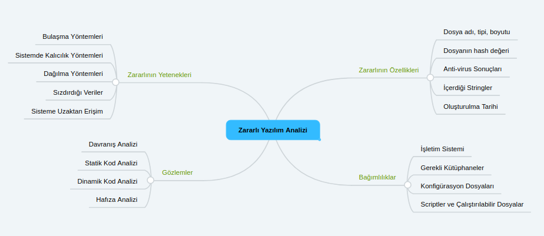

## Lab Ortamı Kurulum

- İzolasyon
- Araçlar
- Hızlı Geri Dönebilme

### İzolasyon

İncelediğimiz zararlının ne gibi özellikleri olduğunu bilmediğimiz için ortamı izole etmemiz gerekir. Sistemde çalıştıktan sonra ağ üzerinden başka bilgisayarlara ya da dosya sistemi üzerinden sanal makineyi çalıştırdığımız sisteme bulaşabilir. Bu tarz sıkıntıların yaşanmaması için analiz yaptığımız ortama dikkat etmeliyiz.

#### Lab Ortamı İçin Gerekli Sanal Makineler

- REMnux -> <https://remnux.org/>
- Windows 7 -> <https://developer.microsoft.com/en-us/microsoft-edge/tools/vms/>

#### VMware Virtual Network

*REMnux* ve *Windows 7*'nin sadece kendi arasında haberleşebilmesi için VMware üzerinden sanal bir ağ oluşturacağız.

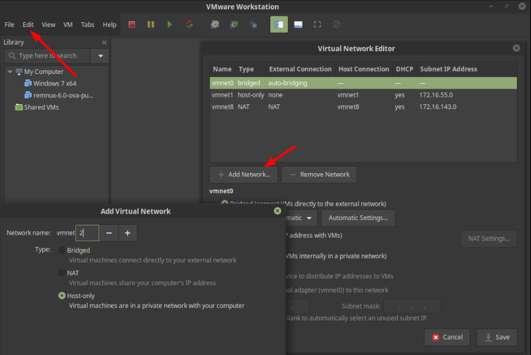

Sanal ağ oluşturmak için VMware menüsünden Edit -> Virtual Network Editor yolunu izleyerek düzenleme penceresine erişiyoruz. *Add Network* seçeneğine basarak *Network name*'i belirliyoruz. Sonrasında Host-only seçeneğini seçiyoruz. Bu kısım önemli çünkü sanal makinelerin fiziksel ağımıza erişememesi gerekir. *Add* diyerek sanal ağımızı kaydediyoruz.


Sanal ağımız oluşturuldu. Şimdi birkaç ayar daha yapmamız gerekiyor. Sanal makinelerin fiziksel ağımız ile olan ilişkisini kestik ama internete de çıkmasını istemiyorsak *Connect a host virtual adapter (wmnet2) to this network* seçeneğindeki tiki kaldırıyoruz. *Subnet IP*'yi de istediğimiz gibi belirleyebiliriz. Ben *192.168.148.0* subnetini kullanacağım.

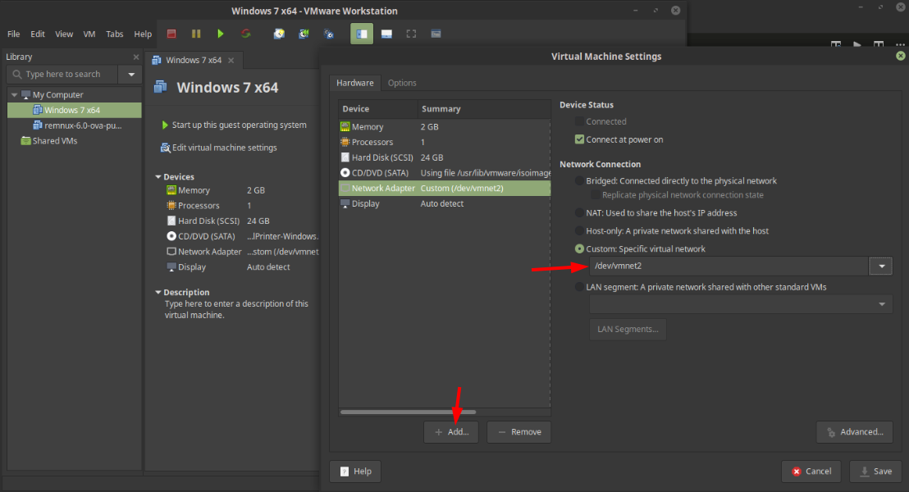

Sanal ağımızı kurduk. Subnetimizi belirledik. Şimdi bu sanal ağımızı sanal makinelerimize eklememiz gerekiyor. Sol listedeki herhangi bir sanal makinemize sağ tıklayarak *Settings* menüsüne gidiyoruz. Bir tane *Network Adapter* tanımlayarak **/dev/vmnet2** sanal ağını seçiyoruz. Bunu diğer sanal makine için de aynı şekilde yapıyoruz.

> **NOT**: Dökümanı hazırlarken Linux kullandığım için sanal ağ /dev altında tanımlanmış. Bu yüzden  /dev/vmnet2 şeklinde sanal cihazın yolu gözüküyor. Windows makinelerde çalışanlar  bunu VMnet2 şeklinde görecektir.

#### INetSim ve FakeDNS kurulum

Sanal makinelerimizin ayarlarını yaptık. Şimdi aynı network üzerindeler ama analiz yaparken bütün isteklerin REMnux üzerinden geçmesini yani REMnux'un bir nevi proxy sunucu olmasını istiyoruz. Bunun için REMnux içerisinde kurulu gelen INetSim ve FakeDNS araçlarını kullanacağız.

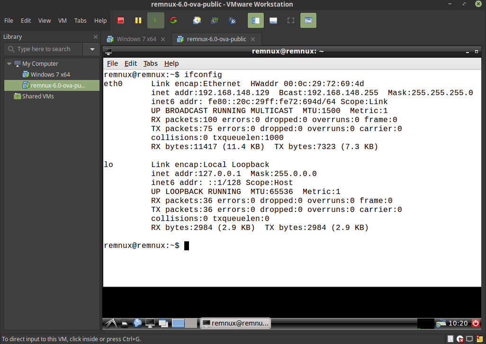

REMnux terminalden `ifconfig` komutu yardımıyla sanal makinemizin ip adresini öğreniyoruz.

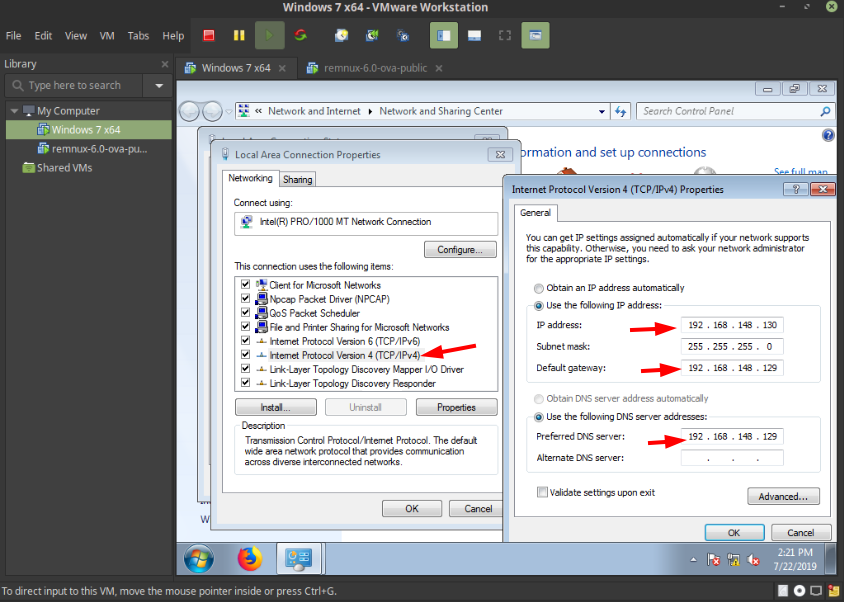

Windows 7'ye geçip *Network and Sharing Center* üzerinden bağlı olduğumuz ağın ayarlarını açıyoruz. *Local Area Connection Properties* seçeneğini seçerek itemlar arasından *Internet Protocol Version 4*'ün özelliklerini açıyoruz. VMware üzerinden oluşturduğumuz sanal ağda DHCP açık olduğu için otomatik IP ataması yapacaktır fakat biz istekleri REMnux üzerine yönlendirmek istediğimiz için manuel atama yapacağız. *Default Gateway* ve *DNS server* kısımlarına REMnux'un IP'sini giriyoruz ve ardından kaydediyoruz. Kısa bir süre sonra ayarlarımız geçerli olacaktır.

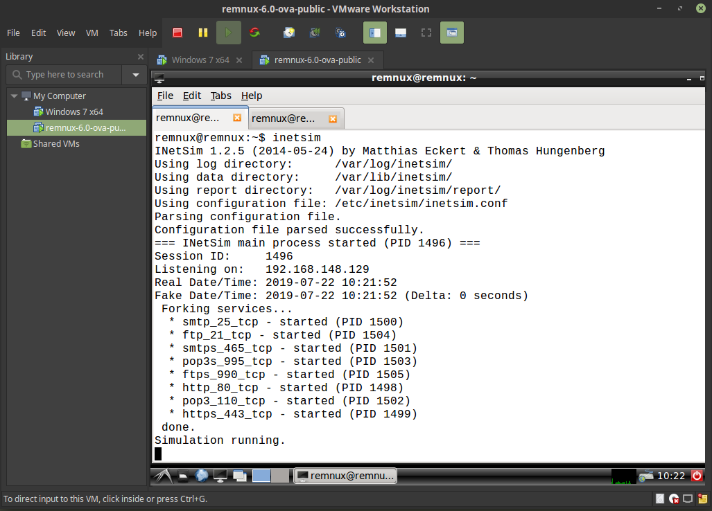

REMnux üzerinden *INetSim* ve *FakeDNS* servislerini başlatıyoruz.

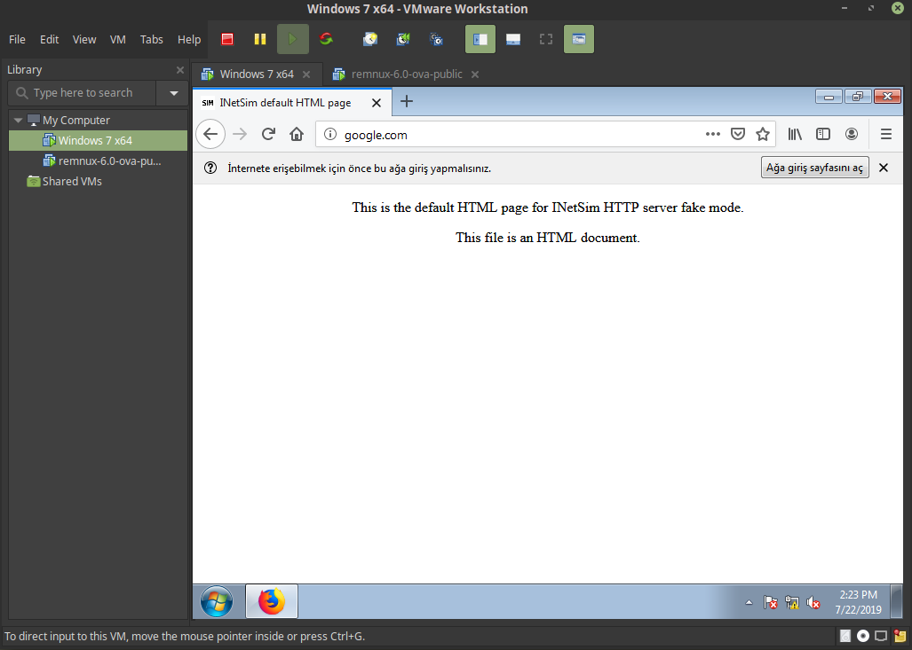

Servisler çalıştıktan sonra Windows 7'ye geçerek Firefox üzerinden google.com a istek yapıyoruz. INetSim'in kendi oluşturduğu statik sayfası bizi karşılıyor.


Windows 7'de yaptığımız istekleri FakeDNS üzerinden kontrol ediyoruz. detectportal.firefox.com ve google.com için DNS istekleri yapılmış. Servislerimiz düzgün çalışıyor.

#### User Account Control


Analiz yaparken programların davranışını etkilememesi için Kullanıcı Bilgilendirmelerini devre dışı bırakıyoruz.

#### Windows Firewall

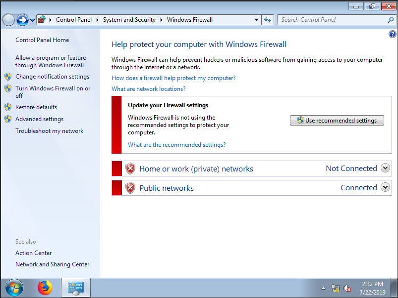

Windows Firewall aktivitesini devre dışı bırakıyoruz. Zararlımız içerde kolayca at koşturabilsin diye yapmadığımız güzellik kalmadı :)

### Araçların Kurulumu

Analiz sırasında gerekli olabilecek araçları sistemin snapshotını almadan önce yüklemek yararımıza olacaktır.

<https://yadi.sk/d/kQinmBHB2-AT2w> (pass: innovera-malware)

> Topluca indirmek istemeyenler için araçların linkleri ilerde toplu şekilde verilecektir.

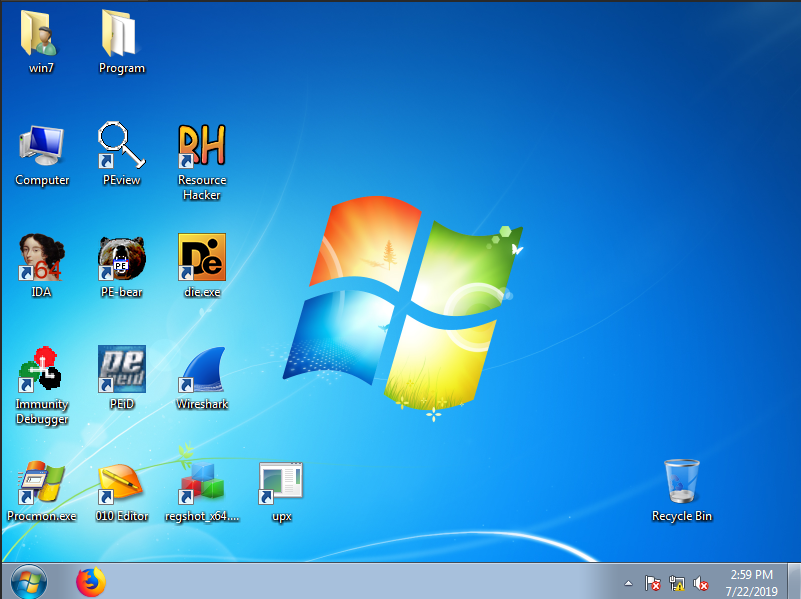

### Hızlı Geri Dönebilme

Testi yaptığımız sistemde oluşabilecek her türlü zararı hızlı bir şekilde geri alabilmek için kullanılan etkili yöntemlerden biri de makinenin stabil halinin snapshotını almaktır. Lazım olan programları yükledikten sonra snapshot almak diğer analizler için de vakit kazandıracaktır.

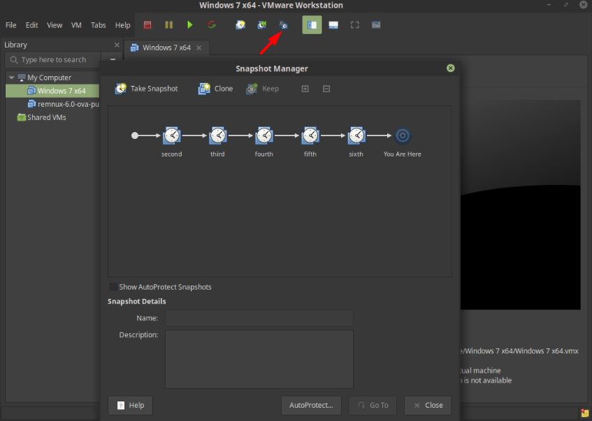
> Snapshot Manager

## Araçlar

### Statik Analiz

#### IDA -> <https://www.hex-rays.com/products/ida/support/download.shtml>

Daha çok tersine mühendislik için kullanılır. Çalıştırılabilir dosyaları açmak ve Disassembling içindir. Özellikle program akışını diyagram şeklinde göstermesi en büyük artısıdır.


#### DiE -> <http://ntinfo.biz/index.html>

Program hakkında bazı temel bilgileri verir. Bunlar programın içerdiği stringler, import ettiği dosyalar, paketlenme bilgisi, yazıldığı dil ve ne zaman linklendiği gibi bilgilerdir.


#### PEiD -> <https://www.softpedia.com/get/Programming/Packers-Crypters-Protectors/PEiD-updated.shtml>

PE (Portable Executable), 16 bit dosya formatı olan MZ formatının geliştirilmiş halidir. MZ formatı 8086 mimarisi için tasarlandığı için günümüz işlemcilerine uyum sağlamıyordu. Bunun sonucunda Microsoft PE dosya formatını geliştirdi. PEiD aracı, yaygın paketleyicileri, şifreleri ve derleyicileri tespit etmek için kullanılan küçük bir programdır.

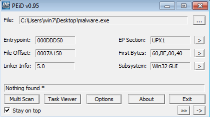

#### PE-bear -> <https://hshrzd.wordpress.com/pe-bear/>

PEiD ile aynı amaca hizmet etmektedir. Zamanında CIA'in de kullanmış olduğu bir araçtır.

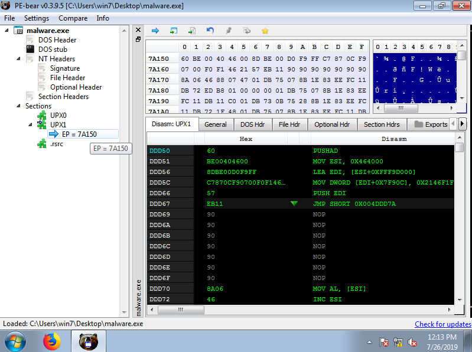

#### PEview -> <https://github.com/dwfault/PEView>

PEview, PE dosya başlıklarında ve dosyanın farklı bölümlerinde saklanan bilgilere göz atmak için sade ve kullanımı kolay bir programdır.

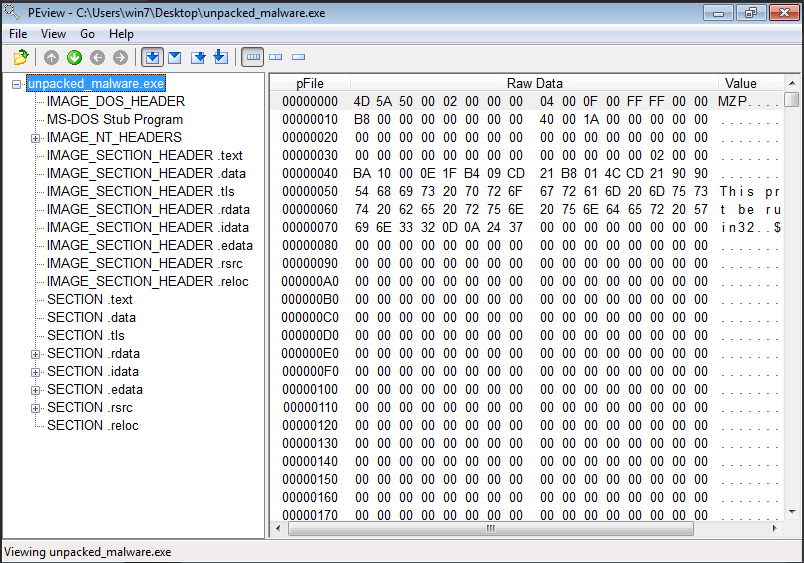

#### ResHacker -> <http://www.angusj.com/resourcehacker/>

Resource Hacker uygulamamız binary üzerinden dosyaları ayıklamamıza yarar. Stringler, resimler, VersionInfo, Manifest ve export edilmeyi bekleyen çalıştırılabilir dosyalar bunlara örnek gösterilebilir.

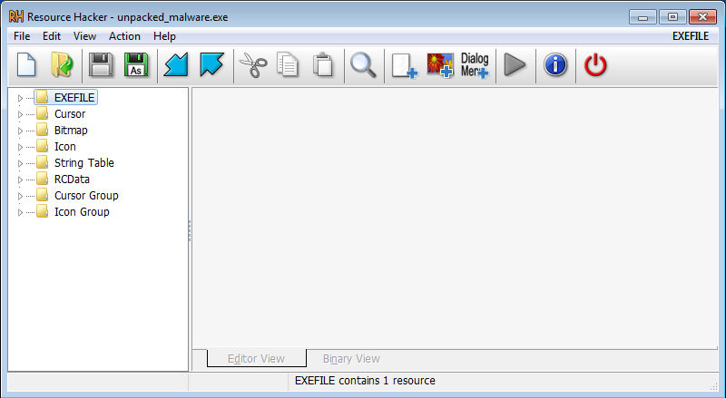

#### Strings -> <https://docs.microsoft.com/en-us/sysinternals/downloads/strings>

Yukarıda saymış olduğumuz programlar her ne kadar bizim stringleri çıkarma ihtiyacımızı karşılasada bazı durumlarda ihtiyacımız düşebilir.

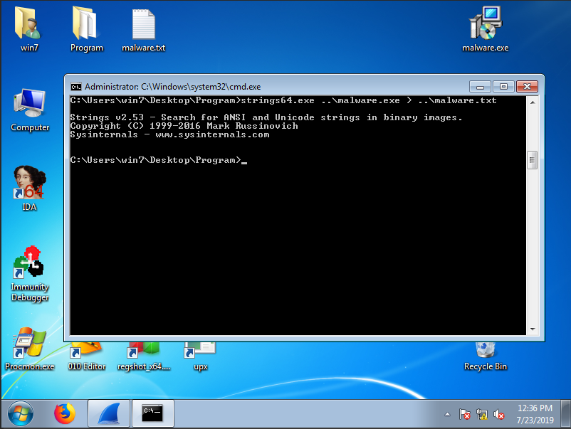

#### 010 Editor -> <https://www.sweetscape.com/010editor/>

Binary üzerinde istediğimiz değişikliği yapabilmemizi sağlayan Hex Editor.

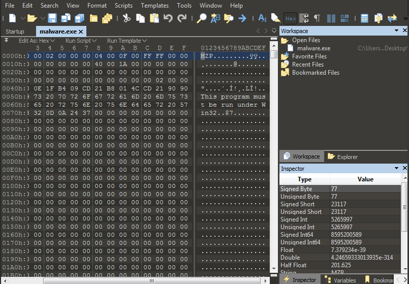

#### Malcode Analyst Pack -> <http://sandsprite.com/iDef/MAP/>

İçerisinde zararlıdaki stringleri bulmak, zararlının hashini almak, zararlıyı virustotale yükleyerek raporunu almak ve daha bir çok statik toolu barındırmaktadır. Programı yükledikten sonra zararlıya sağ tıklayarak açılan menüden istediğimiz seçeneği seçebiliriz.

### Dinamik Analiz

#### Immunity Debugger -> <https://www.immunityinc.com/products/debugger/>

Immunity Debugger, tersine mühendislerin ve exploit geliştiricilerin vazgeçilmez biricik tooludur. Çalışma anında istediğimiz adıma breakpoint koyup programın durmasını sağlayıp o anki registerları, stacki ve memory durumunu kontrol edebildiğimiz sade bir arayüze sahiptir.

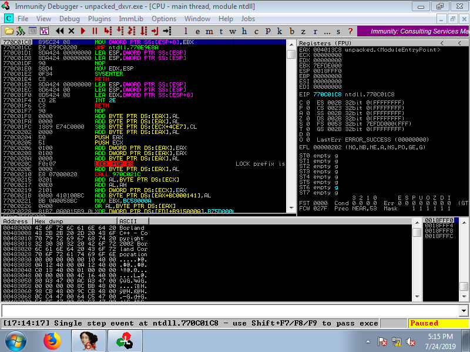

#### OllyDBG -> <http://www.ollydbg.de/download.htm>

Immunity Debugger, OllyDBG'nin 1.10 versiyonu referans alınarak yazılmıştır.

#### Process Explorer -> <https://docs.microsoft.com/en-us/sysinternals/downloads/process-explorer>

Görev Yöneticisi benzeri bir işlevi vardır. O an çalışan process, threadleri listeler. Dosyanın nereden çağrıldığı ne zamandan beri çalıştığı gibi bilgileri barındırır.

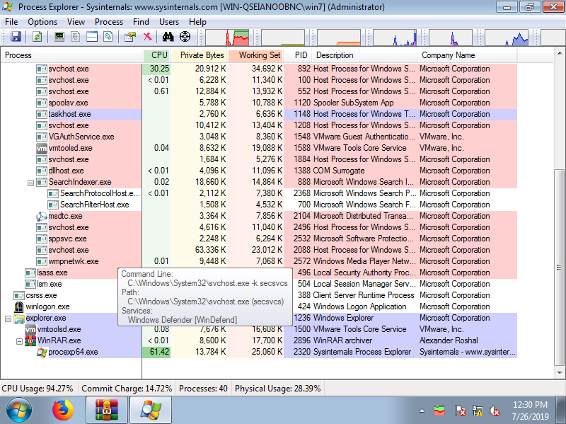

#### Process Monitor -> <https://docs.microsoft.com/en-us/sysinternals/downloads/procmon>

Windows için gerçek zamanlı olarak Dosya İşlemleri, Registry kayıtları ve process thread işlemlerinin gösterildiği tooldur.

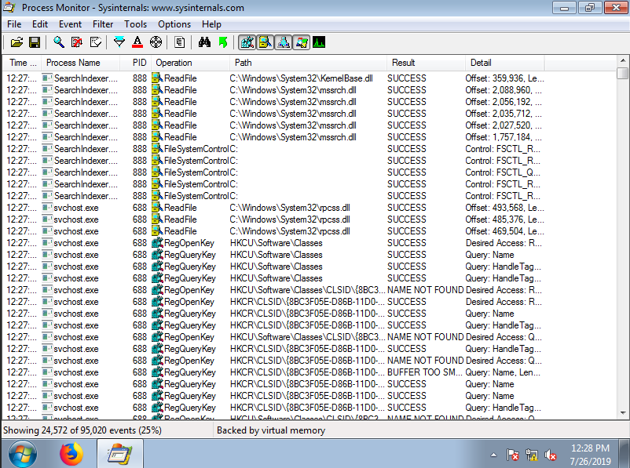

#### WireShark -> <https://www.wireshark.org/download.html>

Wireshark network trafiğinin, bir grafik arayüz üzerinden izlenmesini sağlayan, pek çok zaman hayat kurtarıcı öneme sahip bir programdır. Uygulamanın kurulu olduğu bilgisayar üzerinden anlık network trafiği izlenebileceği gibi, daha önce kaydedilmiş dosyaların incelenmesi amacı ile de kullanılabilir. Standart kurulumda interfaceleri dinleyemiyor. Yardımcı program olan WinPcap -> <https://www.winpcap.org/install/default.htm> programını kurmamız gerekiyor.

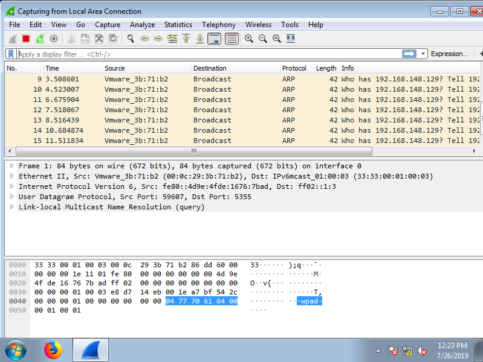

#### RegShot -> <https://portableapps.com/apps/utilities/regshot_portable>

Regshot, kayıt defterinizin hızlı bir şekilde anlık görüntüsünü almanızı ve ardından sistem değişikliklerini yaptıktan veya yeni bir yazılım yükledikten sonra alınan ikinci görüntüyü karşılaştırmanızı sağlayan açık kaynaklı (LGPL) bir kayıt defteri karşılaştırma programıdır.

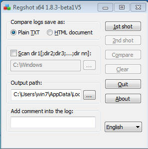

## Analiz

### RegShot

Bu eğitimde bir keylogger programını analiz edeceğiz. Analizimize ilk olarak Registry kayıtları ile başlıyoruz. Keyloggerı çalıştırmadan önce RegShot programını açıp kayıt defterinin bir görüntüsünü alıyoruz. Ardından keyloggerı çalıştırıyoruz. Ekrana herhangi bir şey gelmiyor, ama keyloggerın davranışını bildiğimiz için arkaplanda çalışacağını biliyoruz. Kısa bir aranın ardından kayıt defterinin ikinci görüntüsü alıyoruz ve karşılaştırıyoruz. Kayıt defteri üzerine eklenen yeni keyler, yeni değerler ve modifiye edilen değerleri bize listeliyor.

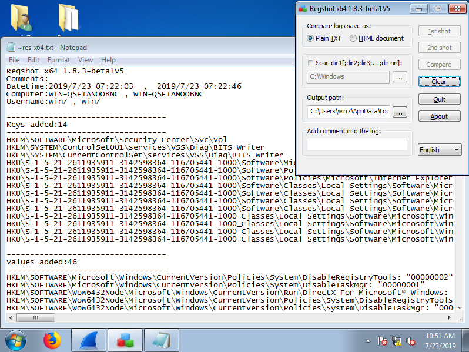

Bu satırlardan ilgilimizi çekenleri inceleyelim.

- **HKLM\SOFTWARE\Microsoft\Security Center\Svc\Vol**
  - Windows güvenlik merkezindeki uyarılar ile ilgilenen \Svc kaydının altına yeni bir key ekliyor. Buradaki amaç bize güvenlik duvarı tarafından hiçbir uyarı gösterilmemesidir. Zararlımız kendini yavaş yavaş açığa çıkartmaya başladı.
- **HKLM\SOFTWARE\Microsoft\Windows\CurrentVersion\Policies\System\DisableRegistryTools: "00000002"**
- **HKLM\SOFTWARE\Microsoft\Windows\CurrentVersion\Policies\System\DisableTaskMgr: "00000001"**
  - Bu iki kayıt ise Kayıt Defteri ve Görev Yöneticisini disable etmek için eklenmiş olan değerlerdir.
- **HKLM\SOFTWARE\Wow6432Node\Microsoft\Windows\CurrentVersion\Run\DirectX For Microsoft® Windows: "C:\\\Windows\\\Temp\\\dxvr.exe"**
  - Burada ise sistem her açıldığında otomatik olarak başlamak için \Run keyi altına kendisini DirectX programı değeri olarak ekliyor. Bu arada keylogger çalıştığında yeni bir dosya oluşturduğunu da teyit etmiş olduk. Üstelik simgesini de DirectX Diagnostic Tool (dxdiag.exe) un simgesi olarak değiştirmiş.
- **HKLM\SOFTWARE\Wow6432Node\Microsoft\Windows NT\CurrentVersion\SystemRestore\DisableSR: "00000001"**
  - Sistemin geri yükleme yapmasını engellemek için \SystemRestore altındaki \DisableSR değerini değiştiriyor.
- **HKLM\SOFTWARE\Microsoft\Security Center\cval: 0x00000001**
  - "User Account Control" tarafından verilen bir uyarı olan "Bu programı gerçekten çalıştırmak istiyor musunuz?" sorusunu atlamak için değiştirilmiştir. Kullanıcının hiçbir şeyden şüphelenmemesi lazım :)

### FakeDNS

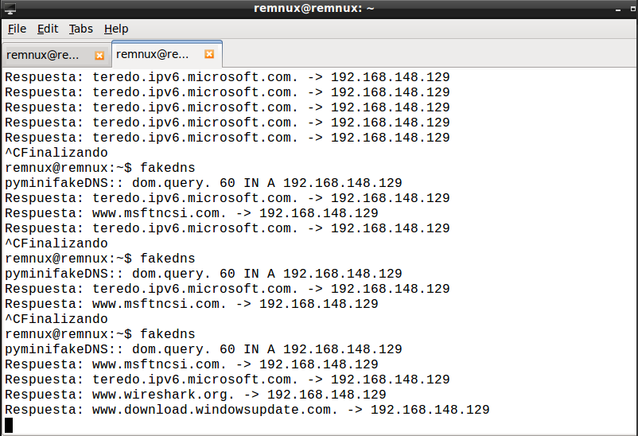

Zararlımız ilk aşamada hiçbir yere bağlanmaya çalışmıyor. Tetiklenmek için bir zamanı bekliyor olabilir ya da hiç öyle bir özelliği olmayabilir. Bunu ilerleyen aşamalarda kullandığı API'leri de inceleyerek daha da derine inip analiz edeceğiz.

### Strings - 01

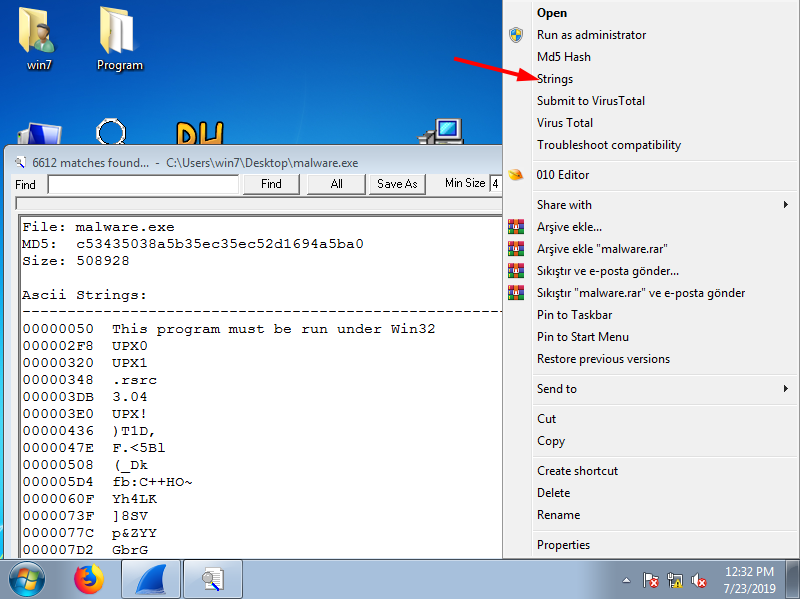

Bu satırlardan bizim için önemli olanları inceleyelim.

- **00000050  This program must be run under Win32**
  - Programın DOS HEADERındaki uyarı mesajıdır.
- **000002F8  UPX0**
- **00000320  UPX1**
  - Programın UPX ile packlendiğini gösteriyor. İlerleyen aşamalarda unpacking işlemine değineceğiz.
- **0007C174  KERNEL32.DLL**
- **0007C181  ADVAPI32.DLL**
- **0007C18E  COMCTL32.DLL**
- **0007C19B  GDI32.DLL**
- **0007C1A5  OLEAUT32.DLL**
- **0007C1B2  USER32.DLL**
  - Program tarafından import edilen DLL dosyalarımız.
- **0007C1BE  LoadLibraryA**
- **0007C1CC  GetProcAddress**
- **0007C1DC  VirtualProtect**
- **0007C1EC  VirtualAlloc**
- **0007C1FA  VirtualFree**
- **0007C208  ExitProcess**
- **0007C216  RegCloseKey**
- **0007C224  ImageList_Add**
- **0007C23A  GetDC**
  - Program tarafından kullanılan fonksiyonlar. Programımız packlendiği için kullanmış olduğu diğer fonksiyonları şu an göremiyoruz ama bu hiç göremeyeceğimiz anlamına gelmiyor :)
- Strings aracımız en altta Unicode stringleri de bulduğunu söylüyor. Biraz inceledikten sonra şimdilik bizim için hiçbir şey ifade etmediğini anlıyor ve bu kısmı atlıyoruz.

### DiE (Detect it Easy)

Zararlımız packlendiği için içerisindeki stringleri alırken fazla başarılı olamadık. Zararlımız hakkında işimize yarayacak bilgiler bulmaya devam etmek için zararlıyı DiE programına veriyoruz.

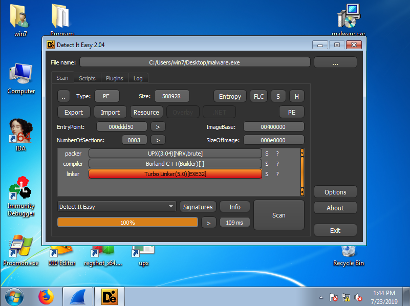

Zararlımızın UPX ile packlendiğini doğruluyoruz. Bunun üzerine upx toolu ile zararlımızı unpacking işlemine tabi tutmamız gerekiyor. Upx toolumuzun olduğu dizine gidip cmd üzerinden unpacking işlemini gerçekleştiriyoruz.

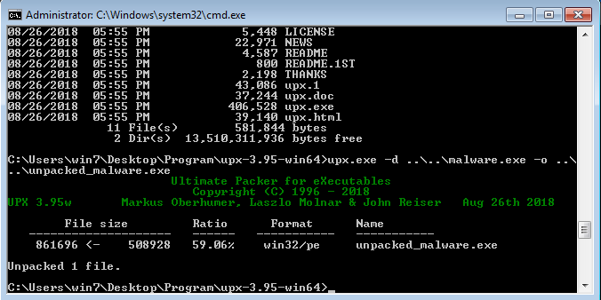

```cmd
C:\Users\Win7\Desktop\Program\upx-3.95-win64> upx.exe -d ..\..\malware.exe -o ..\..\unpacked_malware.exe
```


Unpack ettiğimiz zararlımızı tekrar DiE ye verdiğimizde unpack işleminin başarılı bir şekilde olduğunu görüyoruz. Şimdi string çıktılarına tekrar bakalım.

### Strings - 02


Şimdiki çıktımız biraz daha anlamlı oldu. Unicode kısmında çok fazla anlamlı stringler belirdi. Bu çıktımızı da biraz inceleyelim.

- **000CA426  st:araweb.info**
- **000CA436  sa:agpano.com**
  - İki tane URL gözüme çarptı. Remnux üzerinde çalıştırdığım FakeDNS programına araweb.info nun düştüğünü farkettim. Başlarda pek dikkatimi çekmemişti ama sonradan stringler içinde bu URLleri görünce zararlımız tarafından internet üzerindeki bu adreslere veri göndermek ya da almak için istek yapıldığını anlamış olduk.
  - 
- **000797A6  chat**
- **000797AB  exefile**
  - Zararlıyı unpack etmeden önce incelediğimizde unicode kısmında görmüş olduğumuz stringler burada karşımıza çıktı. Daha da ilginci sonraki iki satırda \Temp altında iki tane dosya yolunun çıkmasıydı. Buüyük ihtimalle yukarıdaki chat ve exefile zararlının dosya export ederken kullandığı belirteçlerdi.
- **000797B4  \Temp\dxvr.exe**
- **000797C3  \Temp\dxvr.txt**
  - Bu iki dosya hakkındaki şüphemizi doğrulamak için \Temp altını bi kontrol edelim.
  - 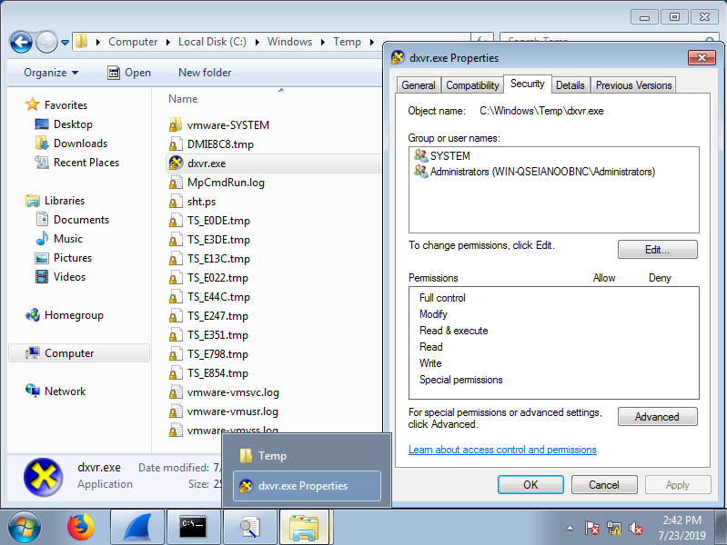
  - Aslında RegShot ile kayıt defteri değişikliklerini incelerken bunu farketmiştik ama dosyayı fazla incelemedik. Dosyanın özelliklerine baktığımızda yetkilerinin Administrator olduğunu farkediyoruz. Kendisine dxdiag.exe nin simgesini de eklemiş. Administrator yetkileri ile de çalıştığı için son kullanıcı açısından kendisininin silinmemesi gereken bir program olduğu mesajını veriyor, fakat durum hiç de göründüğü gibi değil. Şimdilik bu dosyamızı masaüstüne alalım, analizimizin ilerleyen safhalarında yardımcı olacaktır.
- **00079860  reg add "HKLM\SYSTEM\ControlSet001\Services\SharedAccess\Parameters\FirewallPolicy\StandardProfile\AuthorizedApplications\List" /v"**
- **00079A78  reg add "HKLM\SOFTWARE\Microsoft\Windows NT\CurrentVersion\SystemRestore" /v "DisableSR" /d**
  - Kayıt defterinde yapılan değişiklikleri incelerken bu değerlerde oynama yapıldığını farketmiştik. Bu stringlerle de teyit etmiş olduk.
- **000002F8  .text**
- **0000031F  `.data**
- **00000348  .tls**
- **00000370  .rdata**
  - DOS HEADER dan hemen sonra gelen bu başlıklar aslında zararlımızın unpacked olduğunu gösteriyor. Packlenmiş olan bir programda bu bölümler olmaz.

### PEview

Zararlımız hakkında baya bi bilgi sahibi olduk, fakat dosya formatı olan PE ile alakalı hiç inceleme yapmadık. PEview aracı ile önceden bulduğumuz çoğu bilgiyi doğrulayacağız ve dinamik analize geçmeden önce elimize daha fazla bilgi geçmiş olacak. İncelemeye başlayalım.


İncelemeye ilk olarak unpacking işlemine soktuğumuz malware.exe den başlıyoruz. Strings ve DiE dan aşina olduğumuz UPX0 ve UPX1 leri burada görüyoruz. Zararlımız packlendiği için pek fazla bilgi içermiyor. İncelememize unpacked_malware.exe üzerinden devam edelim.

#### IMAGE_DOS_HEADER


Bu bölüm eski sistemlere uyumluluk açısından eklenmiştir.


Bu bölümde dikkat etmemiz gereken bir tek yer var, asıl programın çalışacağı kısmın File Offset'i.
> File Offset: Programın disk üzerindeki konumunun adresidir.

#### Adres Türleri

İlerleyen bölümlerde üzerinde sıklıkla duracağımız, sürekli karıştırılan bir noktayı aydınlatalım. PE dosya formatını incelerken 3 farklı adres türünden bahsedeceğiz.

- **File Offset**: Dosyadaki elemanların disk üzerinde bulunduğu adrese verilen isimdir.
- **VA (Virtual Address)**: Dosya hafızaya yüklenip tüm hizalamalar yapıldıktan sonra elimizde olan bir elemanın adresine verilen isimdir.
- **RVA (Relational Virtual Address)**: Dosya hafızaya yüklendikten sonraki başlangıç adresi (ImageBase) ile aradığımız elemanın oraya olan uzaklığıdır.

#### MS-DOS Stub Program

Bu bölüm de bir önceki bölüme bağlı olup MS-DOS olan bir sistemde ekrana yazılacak mesajın bulunduğu bölümdür. Üzerinde fazla durmaya gerek yok.


#### IMAGE_NT_HEADERS

Bu bölüm asıl programımız hakkında genel bilgi veriyor. Dikkat ettiyseniz *IMAGE_DOS_HEADER* kısmında bulmuş olduğumuz *File Offset* ilk satırda kendini gösterdi.

- *Signature* kısmında *IMAGE_NT_SIGNATURE* diye bir string var. Bu string dosyanın PE dosyası olduğunu belirtiyor.
- *IMAGE_FILE_HEADER* kısmı bizim için çok önemli bilgiler içeriyor. Açıklama kısımlarından referans alarak sırasıyla gidelim.
  - 
  - **Machine**: Programın çalışabileceği ortamı gösteriyor. x86 sistemlerde çalışabilirmiş.
  - **Number of Sections**: Data kolonunda verilen 0008 değeri kadar SECTION olduğundan bahsediyor. Program çalışma anında bu değeri referans alarak parse etme işleminin bittiğini anlıyor. Soldaki menüden SECTION kısımlarını sayarak teyit edebiliriz.
  - **Time Date Stamp**: Programın ne zaman linklendiği ile ilgili bilgi veriyor. Bu kısım istenildiği zaman değiştirilebilir.
  - **Size of Optional Header**: IMAGE_OPTIONAL_HEDAER kısmının Data kolonunda verilen 00E0 değeri kadar uzun olduğunu söylüyor. Programın düzgün çalışması için gereken bir değerdir.
  - **Characteristic**: Bu kısımdaki başlıklarda programın türü hakkında bilgiler veriyor.
    - **IMAGE_FILE_EXECUTABLE_IMAGE**: Çalıştırılabilir dosya olduğunu gösteriyor.
    - **IMAGE_FILE_32BIT_MACHINE**: 32BIT makinede çalışabileceğini gösteriyor.
    - **NOT!**: İncelediğimiz dosya bir DLL dosyası olsaydı IMAGE_FILE_DLL diye bir kısım olacaktı.
- *IMAGE_OPTIONAL_HEADER* kısmı isminin azizliğine uğramış opsiyonel gibi görünen ama hiç de öyle olmayan bir bölümdür. Ne ki, içerisinde programı debug ederken yardımcı olacak bir çok kısım barındırmaktadır.
  - **Address of Entry Point**: Çalıştırılabilir dosyaların başlangıç noktasının RVAsını gösterir. Genellikle .text sectionında bir yer tutar.
  - **Image Base**: PE formatının yükleneceği adresi bu kısma yazar. Genel olarak 32 bit exe için bu kısımda 0x00400000 (4MB) bulunur. Eğer programda ASLR açık değilse program çalışmaya bu adresten başlar. Bütün programların bu adresten başlamak isteyeceğini varsayarsak nasıl karışmıyor diye bir soru gelebilir. Dosya içinde bulunan Relocation bilgisi ile dosya farklı bir adresten itibaren yüklenir.
  - **Section Alignment**: Bu değer bölümlerin yüklenirken nasıl bir sıralamaya uyacağını gösterir.
  - **File Alignment**: Bölümlerin diskte hangi değerin katlarına uygun olarak sıralanacağını belirtir.
  - **Size of Image**: Dosyadaki bölümlerin toplam boyutunu tutar.
  - **Size of Headers**: PE headerın ve section tablosunun boyutunu tutar.


Sol menüdeki **SECTION .idata** içerisinde programın çalışması için import edilen DLL dosyaları ve bu dosyaların içerisinde hazır bulunup import edilen fonksiyonların listesi var. String analizi yaparken zaten bu stringlere ulaşmıştık ama biraz dağınıktı, burada ise adresleri ile birlikte bulunuyor. İmport edilen her fonksiyon program tarafından kullanılmayabilir. Bu durumu dinamik analizi yaparken inceleyeceğiz, fakat bütün fonksiyonları incelemekten ziyade bir zararlı yazılımı zararlı yapan API'lere odaklanacağız. Bir zararlı yazılım tarafından kullanılabilecek ve bizim açımızdan tehlike arz eden fonksiyonların bir listesini bölüm sonunda vereceğiz.

Buraya kadar her şey anlaşıldıysa can alıcı bir noktaya daha değinmek istiyorum. Dikkatinizi sol menüdeki SECTION'lardan .rsrc ye çekmek istiyorum. Bu bölüm bir PE dosyasının kaynaklarını içerir. Kaynaklar ise örneğin ikonlar, menüler, diyaloglar, sürüm bilgisi, yazı tipi bilgisidir, fakat aynı zamanda isteğe bağlı herhangi bir şey olabilir. Dikkatli olunmaması halinde zararlı yazılımımızı çok kolay ele verebilir.


SECTION .rsrc yazan yerin solundaki +'ya basınca karşımıza uzun bir liste çıkıyor. Yukarıda bahsettiğimiz kaynaklardan herhangi biri olabilir, fakat aşağılarda EXEFILE adında ilgimizi çeken bir kaynak var.


Burada programın içindeki kaynaklarda bir exe dosyası daha var. \Temp altına atılan dxvr.exe dosyası buradan export edilip yüklenmiş olabilir. Bu dosyayı export edip dxvr.exe ile karşılaştıralım. Export edebilmek için alanında kendini kanıtlamış olan ResHacker adlı toolumuzu kullanacağız.

### ResHacker (Resource Hacker)


ResHacker toolumuzu açtıktan sonra soldaki listeden EXEFILE'ı seçtikten sonra içerisindeki CHAT yazısına sağ tıklayıp Save *.bin resource seçeneğine tıklayıp dosyamızı chat.exe adıyla masaüstüne kaydediyoruz.


chat.exe yi export edince dxvr.exe ile simgelerinin aynı olduğunu fark ediyoruz. Simgelerinin aynı olması içeriğinin aynı olacağı anlamına gelmiyor, biz de hemen dosyaların MD5Hashini aldık. Bir de ne görelim, iki dosyanında hashi aynı :) Program çalıştıktan sonra kaynaklarının içerisindeki çalıştırılabilir dosyayı dxvr.exe adı ile export edip Administrator yetkileri ile çalışmasını sağlıyor. Daha dinamik analize geçmeden elimizde hatırı sayılır bilgi oldu. Dinamik analize geçmeden önce dxvr.exe'ye aynı adımları uygulayıp elle tutulur bir şeyler çıkıyor mu kontrol edelim.

### dxvr.exe


Dosyamızı DiEye verince bize UPX ile packlendiğini söylüyor. Hemen unpacking işlemine sokup PEview ile incelemeye devam edelim.

```cmd
C:\Users\win7\Desktop\Program\upx-3.95-win64> upx.exe -d ..\..\dxvr.exe -o ..\..\unpacked_dxvr.exe
                       Ultimate Packer for eXecutables
                          Copyright (C) 1996 - 2018
UPX 3.95w       Markus Oberhumer, Laszlo Molnar & John Reiser   Aug 26th 2018

        File size         Ratio      Format      Name
   --------------------   ------   -----------   -----------
    689152 <-    265216   38.48%    win32/pe     unpacked_dxvr.exe

Unpacked 1 file.
```


Dosyamızı PEview ile incelerken import edilen WININET.DLL gözümüze çarpıyor. **Import Address Table**da bu DLLden import edilen fonksiyonu buluyoruz. **InternetGetConnectedState** fonksiyonu internet bağlantımızın olup olmadığını sorguluyor. Kurmuş olduğumuz Virtual Network internete çıkmadığı için bazı fonksiyonlar tetiklenmemiş olabilir. Buüyük olasılıkla bu yüzden Wiresharktan uygulamaya dair bir bağlantı yakalayamadık. Elimizde yeterince bilgi oldu sanırım. Zararlı yazılımların kullandığı takdirde bizim için sıkıntı çıkarabilecek DLL ve içerdikleri fonksiyonları inceleyelim.

### Windows API

**NOT**: Bazı fonksiyonların sonunda *Ex*, *A* ve *W* karakterleri yer alıyor. Ex, sonuna geldiği fonksiyonun bir önceki sürümüne göre genişletildiğini daha fazla içerik eklendiğini ifade eder. Ex ifadesinden sonra A ve W karakterleri de gelebilir. A, fonksiyonun girdi olarak ANSI standardında string almasını sağlarken W ise UNICODE string girdisini ifade eder.

#### Dosya İşlemleri İle İlgili API'ler

- CreateFile
- ReadFile
- WriteFile
- FindResource
- LoadResource

#### Kayıt Defteri İle Alakalı API'ler

- RegOpenKeyEx
- RegSetValueEx
- RegGetValue

#### Ağ Erişimi -> WinSock API

- WSAStartup
- WSAGetLastError
- connect
- accept
- socket
- send
- recv
- listen
- getaddrinfo

#### Internet Erişimi -> WinINet API

- InternetOpen
- InternetOpenURL
- InternetConnect
- InternetReadFile
- InternetWriteFile
- HTTPOpenRequest
- HTTPSendRequest
- HTTPQueryInfo

#### Internet Erişimi -> Urlmon

- URLDownloadToFile

#### Keylogger Fonksiyonalitesi Sağlayan API'ler

- SetWindowsHookEx
- CallNextHookEx
- MapVirtualKey
- GetKeyState
- GetAsyncKeyState
- GetForegroundWindow
- AttachThreadInput

#### Proses İşlemleri

- VirtualAlloc
- VirtualProtectEx
- OpenProcess
- EnumProcesses
- EnumProcessModules
- CreateRemoteThread
- Process32First/Process32Next
- Module32First/Modeule32Next
- WriteProcessMemory -> Verileri belirli bir bellek alanına yazmak için
- AdjustTokenPrivileges
- IsWow64Process
- QueueUserAPC -> Asenkron Process Çağırma

#### DLL Yükleme ve Fonksiyon Adresi Bulma

- LoadLibrary
- GetProcAddress
- LdrLoadDll

#### Debugger Tespit Amacıyla Kullanılan API'ler

- IsDebuggerPresent
- CheckRemoteDebuggerPresent
- FindWindow -> Açık uygulamaları tespit için
- GetTickCount -> Sistem açıldıktan sonraki geçen süre
- NtQueryInformationProcess
- OutputDebugString

#### Sistemde Kalıcılık Sağlamak İçin Kullanılabilecek API'ler

- CreateService
- ControlService

#### Diğer Dosyalara Atlama

- FindFirstFile
- FindNextFile
- NtQueryDirectoryFile
- CreateFileMapping
- MapViewOfFile

#### COM Nesnesi -> <http://www.csharpnedir.com/articles/read/?id=73>

- OleInitialize
- CoInitializeEx

#### Veri Sızdırmak İçin Kullanılabilecek API'ler

- LsaEnumerateLogonSessions
- SamIConnect
- SamIGetPrivateData
- SamQueryInformationUse
- NetShareEnum -> SAM veritabanındaki parola hashlerini dump etmek için
- ReadProcessMemory
- Toolhelp32ReadProcessMemory

#### Diğer API'ler

- CreateMutex -> Aynı anda tek bir instance çalıştırmak için
- CreateProcess
- ShellExecute
- WinExec -> Belirtilen bir uygulamayı çalıştırmak için kullanılabilir.
- System -> Sistem üzerindeki herhangi bir uygulamayı çalıştırmak için kullanılabilir.
- CryptAcquireContext
- EnableExecuteProtectionSupport
- NtSetInformationProcess
- GetSystemDefaultLangId
- GetTempPath
- SetFileTime
- StartServiceCtrlDispatcher
- IsNTAdmin
- IsUserAnAdmin

### x86 Assembly - Uygulama

x86 mimarisi ile alakalı öğrendiğimiz yeni şeyleri uygulamak ve dinamik analize devam edebilmek için aşağıda kodları bulunan küçük bir uygulama üzerinden incelemelere devam edeceğiz. Kodları Dev-C++ üzerinde derledim. Bazı assembly kodları farklılık gösterebilir. Temelde aynı işlemleri yapan fonksiyonlar olup işlemci düzeyinde iyileştirmelere sahip olabilir. Programımızı *inno.exe* adıyla derleyip linkliyoruz.


*inno.exe* dosyamız oluştuktan sonra Immunity üzerinden analize başlamadan önce import edilen kütüphane ve fonksiyonlarla kafamızı ağrıtmadan programımızın main() fonksiyonuna gitmemiz gerekiyor. Bunun için IDA'yı açıp main() fonskiyonunun hafızaya alındıktan sonraki adresine ulaşıyoruz. ASLR desteği olmadığı için programımız main elemanını burada gözüken *Virtual Adres*e yerleştirecektir. Adresi aldığımıza göre devam edelim.


Immunity programını açtıktan hemen sonra programın aşağısında bulunan komut satırına `b 401516` yazarak main fonksiyonun program hafızaya yüklendikten sonraki konumuna yazılımsal bir breakpoint koymuş olduk.


Koymuş olduğumuz breakpointin doğruluğunu test etmek amacıyla programın yukarısında bulunan konsoldan `b`'ye basarak önceden koyulmuş olan breakpointleri inceliyoruz. Bunlardan ilki Immunity tarafından otomatik olarak koyuluyor. Bizim koymuş olduğumuz breakpoint `PUSH EBP` koduna karşılık geliyor. Bu ifade yeni bir fonskiyona dallandığımızda çalıştırılan ilk komutlardandır.


**F9**'a iki kez bastıktan sonra koymuş olduğumuz breapointe geldik.


Şimdi kodları anlamak adına **F8** ile adım adım ilerliyoruz. Önceki fonksiyondan kalan (EBP) Stack Base Pointer'ı Stack'e gönderiyoruz. Bu ve bundan sonraki bir kaç adım *function prologue* diye geçiyor. Program yeni bir **CALL** çağrısı yaptığında kaldığı yeri unutmamak için bu tarz bir işlem yapıyor.


Function prologue'un sonraki adımı da Stack Pointer'ın main fonksiyonunun Base Pointer'ı olarak atanması adımıdır.


Sonraki adımda Stack Pointer *FFFFFFF0* ile AND işlemine sokularak Stackte 8 Byte'lık bir alan ayrılmıştır.


`SUB ESP,20` komutu ile Stackte 32 Bytelık bir alan ayrılmıştır. Stackte ayrılan bu alan bizim programımızdan ziyade derleyicinin çağırdığı bir sonraki **CALL** çağrısı için ayrılmıştır.


CALL çağrısına dallanmadan geçmek için **F8**'e basarak bir sonraki komuta geçiyoruz. `MOV DWORD PTR SS:[ESP+1C],5` komutu, tanımlamış olduğumuz ilk x değişkenini Stacke yazmamızı sağlıyor. `ESP+1C = 28FEBC`'ye denk geldiği için *28FEBC* adresine 5 değerini *hexadecimal* olarak basıyoruz.


Ardından aynı işlemi y değişkeni için de yapıyoruz. Bu sefer `ESP+18 = 28FEB8` adresine yani ilk değişkenden sonraki 5. Byte'tan itibaren yazıyoruz. Bu durum C'de bir integer değişkenin 4 Byte'lık alanda saklandığını gösteriyor. Bir önceki integerı kaydederken farketmemiş olsak da buradaki değerin *hexadecimal* olarak kaydedildiği aşikar.


*ESP+18* konumundan 0000000A değerini alarak bunu EAX registerına yazdı. Bir sonraki **CALL** çağrısı için hazırık yapılıyor sanki.


EAX registerı içindeki değeri *ESP+4* konumuna yazdı.


Aynı işlemi 00000005 değeri için de tekrarlayıp kendisini ESP registerının gösterdiği adrese yazdı. Şimdiki çağrılan fonksiyonun aslında hangi fonskiyon olduğunu biliyoruz ama içine dallanıp neler olup bittiğini incelemek lazım.


Yapılan CALL çağrısına **F7**'ye basarak dallandıktan sonra Stacke yazılan ifadeye dikkat edelim. Bize vermek istediği mesaj kabaca şu; "inno.00401500 fonksiyonuna dallandın. Geri dönerken gideceğin adres inno.00401548'dir.". Değişkenlerimiz hazır. Topla() fonksiyonuna da dallandık. Şimdi fonksiyonun içinde geçen toplama işleminin nasıl olduğunu bi inceleyelim.


İlk önce kaldığımız yeri unutmamak adına EBP registerını Stacke gönderelim.


Stack Pointer'ı Base Pointer'a eşitleyelim ki fonksiyonun içinde istediğimiz işlemleri gerçekleştirebilelim.


Dev-C++ üzerinde hafıza yönetimi çok iyi olmadığı için gereğinden fazla hafıza alanı kullanmaktan çekinmiyor. Stackten 16 Byte'lık bir alan daha istiyor.


`EBP+8 = 28FEA0` adresinden ilk değişkenimizi alıp EDX registerına atıyoruz.


İkinci değişkenimizi de alıp EAX registerına atıyoruz. Şimdi bunları toplamak lazım.


`ADD EAX,EDX` komutu ile EDX registerındaki değeri EAX registerı üzerine ekliyoruz.


EAX registerı üzerindeki toplam değerimizi `EBP-4 = 28FE94` adresine yazıyoruz.


**LEAVE** komutu ile fonksiyonumuz için ayrılan 16 Byte'lık alanı boşalttık ve **28FE98** adresindeki değeri (yani önceki fonskiyonda kalmış olduğumuz Stack adresini) EBP registerına yazdık. Geri dönüş için gerekli olan Stackin en üstündeki yazıda görüldüğü gibi bir önceki fonskiyonun adresinin yazılı olduğu satır karşımızda duruyor. Artık geri dönmeye hazırız.


RETN instructionı ile stackteki son değer pop ediliyor. Yeni ESP registerı değerimiz `28FEA0`.


EAX registerında tutulan toplam değerimiz *ESP+14* adresine yazılıyor.


Hafıza yönetimi konusunda iyileştirme olmadığı için *ESP+14* adresindeki veri EAX'a tekrar alınıyor. Printf fonksiyon çağrısına geldiğimizde Stackteki son iki değerin printf fonksiyonu için parametre olarak kullanılacağı bir gerçek. İlk parametremizi bu adımda *ESP+4 = 28FEA4* adresine toplamı yazarak elde ediyoruz.


İkinci parametre olarak da "Toplam = %d" yi yüklemiş olduk.


Printf fonksiyonumuzu çağırmadan önce programa küçük bir göz atalım. Henüz program ekranında hiçbir şey yazmıyor.


Bir adım ilerledikten sonra ekrana "Toplam = 15" yazısı geliyor. Aynı anda Stacke bir başka string yazılıyor. Bu string bir sonraki system() fonksiyonu için parametre olarak kullanılacak.


system() fonksiyonu çağrısına geldiğimizde Stackteki stringin yanına *command* ifadesi geldi. Bu string system() fonksiyonunun bir parametresiymiş.


system() fonksiyonunun çağrısının yaptıktan sonra ekranda beliren string, bizden bir tuşa basmamızı istiyor. Herhangi bir tuşa basmadan ilerleyemiyoruz.


Fonksiyondan çıkmadan önce EAX'a sıfır atıyoruz. Bunun amacı main() fonksiyonunda geri dönüş değeri olarak sıfır göndermemiz. **return 0** satırından bunu çok rahat anlayabiliriz.


**LEAVE** instructionı ile fonksiyonda kullanmak üzere ayırdığımız Stack alanını geri iade ediyoruz. **28FEC8** adresindeki değeri *EBP* registerına pop ediyoruz. Main() fonksiyonunda çıkmak için her şey hazır.


Main() fonksiyonundan çıktıktan sonra da EAX registerında ki değerimizi Stacke gönderip exit fonksiyonumuzu çağırıyoruz. Programımız bu şekilde sonlanmış oluyor.


### IDA PRO

API'lere o kadar değindikten sonra şüphelendiğimiz bir API'nin analizini nasıl yapacağımıza değinmeden geçmek olmaz. Zararlımızı tekrar çalıştırmak istediğimizde sebepsizce duruyor. Bu durumdan kurtulmak için son aldığımız snapshota geri dönüyoruz. Zararlımızı tekrardan yükledikten sonra IDA ile statik analizimize devam edeceğiz.


Zararlımız olan dxvr.exe'yi PE dosyası olarak Dissassemble etmesini istiyoruz.


Grafiksel bir ekran bizi karşılıyor. Sağ tıklayıp **Text View** olarak göstermesini istiyoruz. Adresler ile uğraşacağımız ve sadece bir tane API'yi inceleyeceğimiz için bu gösterim bizim için daha anlaşılır olacaktır.


Imports sekmesinde programın çalışmadan evvel kendine dahil ettiği API'leri görüyoruz. Zararlı sayılabilecek olan API'lerimizden WinExec API'sini bulup çift tıklıyoruz. IDA bizi API'nin çağırıldığı yere götürüyor.


API'nin üzerine bir kere tıkladıktan sonra **x** tuşuna basarak API'nin referanslarını (yani program içinde çağrıldığı yerleri) gösteriyor. İlk referansa tıklayarak assembly kod bloğunun olduğu yere gidiyoruz.


Program çalıştıktan sonra WinExec API'sinin ilk çağrıldığı yerin VA (Virtual Address) sını alıyoruz. İki üst satırında **lpCmdLine** ve **uCmdShow** stringlerini görüyoruz. WinExec API'sine [MSDN](https://docs.microsoft.com/en-us/windows/win32/api/winbase/nf-winbase-winexec)'den baktığımız zaman bu stringlerin WinExec'in çalışması için parametre olarak kullanıldığını görüyoruz. Bu parametrelerin içeriğini görmek için dinamik analiz sırasında bu API çağrılmadan hemen öncesine breakpoint koymamız gerekiyor. API'nin çağrıldığı adresi biliyoruz o zaman Immunity Debugger'a geçiş yapalım ve parametrelerin almış olduğu değerleri inceleyelim.

### Immunity Debugger


Aşağıdaki küçük konsola **b 481ee8** yazarak WinExec API'sinin çağrıldığı noktaya bir breakpoint koyduk. Yukarıdaki sekmelerden breakpoint anlamına gelen **b** karakterine basarak breakpointimizin koyulduğunu teyit etmiş olduk. Tekrar **c** karakterine basarak assembly ekranına dönebiliriz.

Programımız şu an kullanıma hazır. **F9**'a basarak programımızın ilk breakpointe kadar çalışmasını sağladık. İlk breakpoint Immunity tarafından otomatik olarak koyuluyor. Daha sonra bizim koyduğumuz breakpointe kadar çalışması için **F9**'a tekrar basıyoruz.


Tam fonksiyonu çağıracakken durdu. Şimdi **F7**'ye basarak çağrılan fonksiyonun içine gireceğiz. Çağrılan fonksiyonun içine girmeden önce stack ve registerların değerlerini kontrol edelim. Sağ alttaki stack ekranımızda görüldüğü üzere fonksiyonumuz çağrılmadan hemen önce iki tane paramtere girilmiş. Bunlardan biri daha önce MSDN'den öğrendiğimiz CmdLine parametresidir.

```assembly
CmdLine = "reg add "HKCU\Software\Policies\Microsoft\Internet Explorer\Control Panel" /v "HomePage" /d "00000001" /f"
```

Parametrenin içeriğinden anladığımız kadarıyla kayıt defterine yeni bir kayıt ekliyor. Programımız kendisini Administrator yetkileri ile çalıştırdığı için hiç bir hata almadan bu kaydı ekleyebiliyor. Tekrardan **F7**'ye basarak çağrılan fonksiyonun içine giriyoruz.

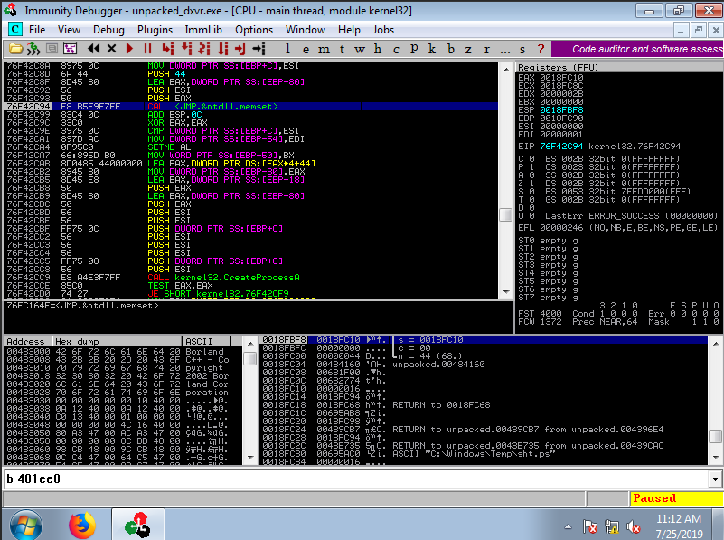

Fonksiyon çalıştırılmak üzere hazırlıkları tamamladıktan sonra görevi ntdll'e aktarıyor. ntdll'in içerisinde nasıl bir çağrı yapıldığını anlamaya çalışmamıza gerek yok o yüzden **F8**'e basarak bir sonraki assembly koduna geçiyoruz.


Register kaydı eklemek için çağrılan fonksiyonun içerisinde bir tane process oluşturulduğunu görüyoruz. Stack bölümüne baktığımızda WinExec fonksiyonunun çağırdığı parametrelerin haricinde processin oluşturulması için gereken parametrelerin de eklenmiş durumda olduğunu görüyoruz.


WinExec fonksiyonu ile başka işimiz kalmadı. **Ctrl+F9**'a basarak içinde bulunduğumuz fonksiyonun sonuna geliyoruz. Fonksiyonun içine girmeden önce stacke kaydettiğimiz, programın son kaldığı adres gözüküyor. **F8**'e basarak WinExec komutunu ilk çağırdığımız yere dönüyoruz.

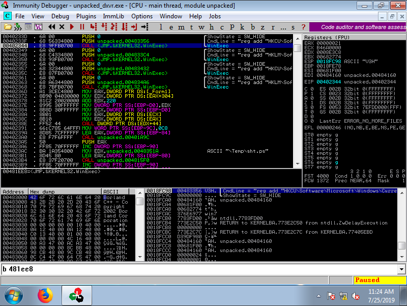

WinExec analizini yaparken registrya kayıt ekleme işinin bu fonksiyon ile yapıldığını öğrenmiş olduk. Önceki analizlerimizden bildiğimiz kadarıyla birden çok registry kaydı ekleniyor. Bu kayıtların hepsinin WinExec fonksiyonu ile eklendiğini varsayarak WinExec üzerine koyduğumuz breakpointe bir daha uğrayacağımızı farzediyoruz. Immunity'nin bir sonraki breakpointe kadar çalışması için **F9**'a basarak tezimizi doğruluyoruz. Eklenen diğer kayıtlardan bazılarını burada toplu şekilde görüyoruz. Fonksiyonun içindeki işleyiş aynı olduğu için fonksiyona dallanmamıza gerek yok. Şüpheli gördüğümüz diğer API'leri de bu şekilde kontrol edebiliriz.

## Online Sandboxlar

Buraya kadar bir malware analizi sırasında yapılması gerekenleri anlatmaya çalıştım. Bu alanda daha fazla pratik yapabilmek için örnekler barındıran bir çok site mevcuttur. Online Sandbox olarak anılan bu siteler başkaları tarafından yüklenen zararlı yazılımları analiz edebilecek izole bir ortam sunmakla beraber zararlı yazılımları indirmemize ve kendi ortamımızda analiz etmemize olanak sağlar.

- <https://app.any.run/submissions/>
- <https://www.hybrid-analysis.com/>

## Kaynakça

- <https://blacknbunny.github.io/2019/05/16/malware-analysis-part-1.html>
- <https://ring0.info/posts/pe-dosya-formatina-dalis>
- <http://blog.btrisk.com/2018/01/zararli-yazilim-analizi-egitimi-1.html>
- <https://blog.kowalczyk.info/articles/pefileformat.html>
- <https://docs.microsoft.com/en-us/windows/win32/debug/pe-format>
